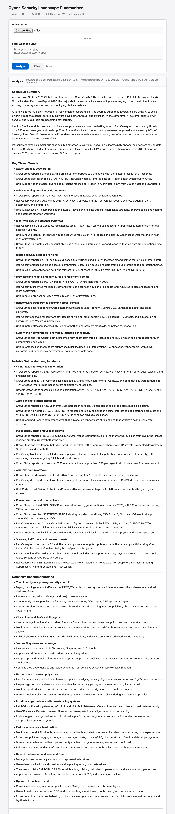
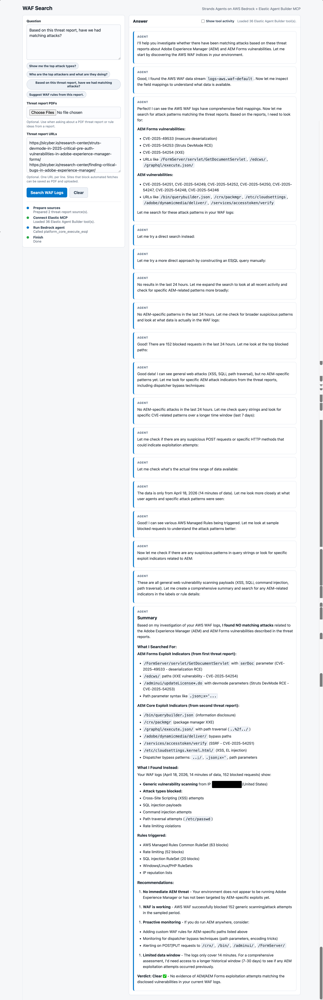

# AWS Bedrock Playground

Hello-world examples for the main AWS Bedrock surfaces: Bedrock Runtime, Bedrock Agents, Bedrock Mantle, Strands Agents, MCP tools, document extraction, and voice streaming.

## Key concepts shown

| Concept | Examples | What to look for |
|---------|----------|------------------|
| Bedrock Runtime vs Bedrock Mantle | `01`, `03`-`05`, `13`, `21`, `22` | Runtime uses native Bedrock APIs such as Converse / InvokeModel. Mantle exposes OpenAI-compatible and Anthropic-compatible SDK paths with Bedrock bearer tokens. |
| OpenAI-compatible Bedrock calls | `04`, `05`, `13`, `22` | OSS models use Mantle `/v1`; GPT-5.5 / GPT-5.4 use Mantle `/openai/v1` and the Responses API. |
| Strands agents | `06`-`12`, `14`-`23`, `26`-`30` | Single agents, multi-agent orchestration, graph workflows, swarms, memory, structured output, and custom model adapters. |
| Tools | `08`, `11`, `12`, `16`, `17`, `23`, `26`-`30` | Native Strands tools, `@tool` decorators, community tools such as `current_time` / `rss`, durable local-memory tools, and externally hosted tools. |
| MCP (Model Context Protocol) | `17`, `23`, `26`, `30` | Local stdio MCP tools, remote MCP tools, Exa MCP web search, Elastic Agent Builder MCP tools for searching WAF logs, and remote documentation MCP servers for teaching platform tasks. |
| HITL (Human in the Loop) | `11`, `12` | CLI approval with `handoff_to_user` and browser approval with Strands interrupts before a sensitive `send_email` tool runs. |
| Streaming UI / SSE | `12`, `13`, `26`, `29`, `30` | Browser apps that stream tokens and status updates with FastAPI and Server-Sent Events, with shared Markdown rendering for model output. |
| Document extraction / RAG prep | `13`-`15`, `24`, `25`, `26`, `29` | Unstructured PDF extraction, element-level JSONL, source-attributed prompt chunks, and PDF/URL threat-report context. |
| Embeddings / local RAG | `31` | Titan Text Embeddings V2, local text/Markdown chunking, in-memory cosine retrieval, and cited answers through Converse. |
| Cyber detection / policy review | `26`-`29` | WAF log investigation, detection engineering, IAM least-privilege review, threat-intel mapping, and risk analysis. |
| Guardrails and safety controls | `06`, `11`, `12`, `19` | Bedrock guardrails, approval gates for sensitive actions, and DockerSandbox-based static code triage. |
| Voice / bidirectional streaming | `18` | Amazon Nova Sonic through Strands bidirectional streaming with microphone/speaker IO. |

## Files

| File | Model | API / Path | Notes |
|------|-------|-----------|-------|
| `examples/core/01_bedrock_converse_foundation_model.py` | Claude Haiku 4.5 | Converse API · `bedrock-runtime` | Recommended for most use cases |
| `examples/core/02_bedrock_invoke_agent.py` | _(your agent)_ | InvokeAgent · `bedrock-agent-runtime` | Requires a pre-created agent |
| `examples/mantle/03_mantle_anthropic_messages.py` | Claude Haiku 4.5 | Anthropic Messages API · `bedrock-mantle` | Uses `anthropic[bedrock]` SDK |
| `examples/mantle/04_mantle_openai_responses_oss.py` | GPT OSS 120B | OpenAI Responses API · `bedrock-mantle /v1` | OSS/Nova models use `/v1` path |
| `examples/mantle/05_mantle_gpt55_codex.py` | GPT-5.5 | OpenAI Responses API · `bedrock-mantle /openai/v1` | Codex coding agent |
| `examples/core/06_strands_bedrock_guardrail_agent.py` | Claude Haiku 4.5 | Strands SDK · `bedrock-runtime` | Single agent with Bedrock guardrail |
| `examples/agents/07_strands_multiagent_rss_briefing.py` | Claude Haiku 4.5 | Strands SDK · `bedrock-runtime` | Multi-agent: fetcher + time + orchestrator summarising Krebs feed |
| `examples/agents/08_strands_custom_tools.py` | Claude Haiku 4.5 | Strands SDK · `bedrock-runtime` | Custom tools with `@tool` decorator |
| `examples/agents/09_strands_file_session_history.py` | Claude Haiku 4.5 | Strands SDK · `bedrock-runtime` | Persistent conversation with `FileSessionManager` + `current_time` |
| `examples/agents/10_strands_swarm_handoff.py` | Claude Haiku 4.5 | Strands SDK · `bedrock-runtime` | Swarm: autonomous agent handoff (triage → specialist) |
| `examples/agents/11_strands_streaming_cli_hitl.py` | Claude Haiku 4.5 | Strands SDK · `bedrock-runtime` | Streaming CLI chat + `current_time` + HITL via `handoff_to_user` |
| `examples/agents/12_strands_webui_sse_hitl.py` | Claude Haiku 4.5 | Strands SDK · `bedrock-runtime` | FastAPI + SSE browser chat + `current_time` + HITL approval card |
| `examples/cybersecurity/13_mantle_gpt55_cybersec_webui.py` | GPT-5.6 Sol/Terra/Luna, GPT-5.5, GPT-5.4 | OpenAI Responses API · `bedrock-mantle /openai/v1` | FastAPI + SSE summary UI with a model picker, retries, heartbeat events, and GPT-5.4 fallback |
| `examples/cybersecurity/14_strands_cybersec_triage_graph.py` | GPT OSS 120B | Strands Graph · `bedrock-runtime` | Multi-agent cyber triage graph for PDF, URL, HTML, or text inputs |
| `examples/cybersecurity/15_strands_structured_cybersec_brief.py` | GPT OSS 120B | Strands structured output · `bedrock-runtime` | Validated Pydantic cyber briefing object from PDF, URL, HTML, or text inputs |
| `examples/agents/16_strands_local_memory_advisor.py` | Claude Haiku 4.5 | Strands tools · `bedrock-runtime` | Local durable memory tools for briefing preferences |
| `examples/agents/17_strands_mcp_repo_tools_agent.py` | Claude Haiku 4.5 | Strands MCP · `bedrock-runtime` | Native tools + local stdio MCP + optional remote MCP tools in one agent |
| `examples/cybersecurity/18_nova_sonic_voice_incident_briefing.py` | Nova Sonic | Strands bidirectional streaming · `bedrock-runtime` | Voice incident briefing assistant |
| `examples/cybersecurity/19_strands_docker_sandbox_code_triage.py` | Claude Haiku 4.5 | Strands DockerSandbox · `bedrock-runtime` | Static Python snippet triage through a Docker sandbox |
| `examples/agents/20_strands_workflow_research_report.py` | Claude Haiku 4.5 | Strands workflow tool · `bedrock-runtime` | Dependent cyber research workflow with task status |
| `examples/mantle/21_strands_mantle_anthropic_adapter.py` | Claude Haiku 4.5 | Strands SDK · `bedrock-mantle /anthropic` | Custom Strands model adapter using `AsyncAnthropicBedrockMantle` |
| `examples/mantle/22_strands_mantle_openai_gpt54.py` | GPT-5.4 | Strands SDK · `bedrock-mantle /openai/v1` | Custom Strands `OpenAIResponsesModel` adapter for GPT-5.4 |
| `examples/agents/23_strands_rss_exa_swarm.py` | Claude Sonnet 4.5 | Strands Swarm · `bedrock-runtime` + Exa MCP + optional Playwright MCP | RSS swarm that filters recent feed items, fetches article pages, can use web search for detail, and can optionally use Chrome-rendered Playwright MCP for dynamic articles |
| `examples/document-processing/24_pdf_to_unstructured_elements.py` | Local only | Unstructured OSS · `partition_pdf` | Shows PDF elements as JSONL with type, text, and metadata |
| `examples/document-processing/25_pdf_elements_to_prompt_chunks.py` | Local only | Unstructured OSS · `partition_pdf` | Converts PDF elements into source-attributed prompt chunks for AI models |
| `examples/cybersecurity/26_strands_elastic_waf_mcp_webui.py` | Claude Haiku 4.5 by default | Strands MCP · `bedrock-runtime` + Elastic Agent Builder MCP | FastAPI + SSE WAF investigation UI over Elastic Cloud logs, including attack-pattern discovery and timeline reconstruction; model can be overridden with `BEDROCK_MODEL_ID` |
| `examples/cybersecurity/27_strands_detection_engineering.py` | GPT OSS 120B | Strands structured output · `bedrock-runtime` | Turns JSONL/CSV security telemetry into findings, Sigma-style detections, ECS-aware Elastic hunts, and response actions using official SigmaHQ examples as references |
| `examples/cybersecurity/28_strands_iam_policy_risk_review.py` | GPT OSS 120B | Strands structured output · `bedrock-runtime` | Reviews IAM policy JSON for wildcard permissions, privilege-escalation paths, and least-privilege fixes |
| `examples/cybersecurity/29_strands_threat_intel_risk_chat.py` | Claude Haiku 4.5 | Strands SDK · `bedrock-runtime` | Interactive CLI or FastAPI/SSE WebUI threat-intel and risk chat with CVE/EUVD, CWE/CAPEC, paginated MITRE ATT&CK Enterprise and MITRE ATLAS tools, OWASP Top 10 2025/2021, cached Security Cards/Unified Kill Chain PDF references, FAIR Monte Carlo ALE, and ROSI tools |
| `examples/agents/30_strands_remote_mcp_teaching_agent.py` | Claude Haiku 4.5 | Strands MCP · `bedrock-runtime` + remote docs MCP | CLI or FastAPI/SSE tech teaching agent that uses AWS Knowledge, Cloudflare Docs, Microsoft Learn, and optional Google Developer Knowledge MCP servers to teach how to do tasks across platforms, with ContextOffloader for large docs tool responses |
| `examples/agents/31_bedrock_embeddings_local_rag.py` | Titan Text Embeddings V2 + Claude Haiku 4.5 | InvokeModel embeddings + Converse · `bedrock-runtime` | Local `.txt` / `.md` RAG demo: chunk files, embed with `amazon.titan-embed-text-v2:0`, cosine-rank in memory, and answer with source citations |

## Cybersecurity examples matrix

| Use case | Script | Model path | Required env vars | Port | External services |
|----------|--------|------------|-------------------|------|-------------------|
| OpenAI cyber report summary WebUI | `examples/cybersecurity/13_mantle_gpt55_cybersec_webui.py` | Bedrock Mantle `/openai/v1` Responses API | `AWS_PROFILE` optional; active AWS credentials need `bedrock-mantle:CreateInference` | `8001` | User-supplied public URLs; local PDF extraction |
| Multi-agent cyber triage graph | `examples/cybersecurity/14_strands_cybersec_triage_graph.py` | Strands `BedrockModel` via `bedrock-runtime` | `AWS_PROFILE` optional; `BEDROCK_MODEL_ID` optional | N/A | Shodan CVEDB for CVE/EUVD enrichment; user-supplied public URLs |
| Structured cyber brief extraction | `examples/cybersecurity/15_strands_structured_cybersec_brief.py` | Strands structured output via `bedrock-runtime` | `AWS_PROFILE` optional; `BEDROCK_MODEL_ID` optional | N/A | Shodan CVEDB for CVE/EUVD enrichment; user-supplied public URLs |
| Spoken incident briefing | `examples/cybersecurity/18_nova_sonic_voice_incident_briefing.py` | Nova Sonic via `bedrock-runtime` bidirectional streaming | `AWS_PROFILE` optional | N/A | Local microphone/speaker devices |
| Static Python snippet triage in Docker | `examples/cybersecurity/19_strands_docker_sandbox_code_triage.py` | Strands `BedrockModel` via `bedrock-runtime` | `AWS_PROFILE` optional; `BEDROCK_MODEL_ID` optional; `STRANDS_SANDBOX_CONTAINER` optional | N/A | Local Docker container named `strands-cybersec-sandbox` by default |
| Elastic WAF attack-pattern and timeline investigation WebUI | `examples/cybersecurity/26_strands_elastic_waf_mcp_webui.py` | Strands MCP via `bedrock-runtime` | `AWS_PROFILE` optional; `BEDROCK_MODEL_ID` optional; `ELASTIC_AGENT_BUILDER_MCP_URL` or `ELASTIC_KIBANA_URL`; `ELASTIC_API_KEY` or `ELASTIC_AUTH_HEADER` | `8002` | Elastic Agent Builder MCP; user-supplied public URLs; local PDF extraction |
| Detection engineering from telemetry | `examples/cybersecurity/27_strands_detection_engineering.py` | Strands structured output via `bedrock-runtime` | `AWS_PROFILE` optional; `BEDROCK_MODEL_ID` optional | N/A | Elastic ECS CSV and SigmaHQ examples when reachable, with offline fallbacks |
| IAM least-privilege review | `examples/cybersecurity/28_strands_iam_policy_risk_review.py` | Strands structured output via `bedrock-runtime` | `AWS_PROFILE` optional; `BEDROCK_MODEL_ID` optional | N/A | None beyond AWS Bedrock |
| Threat-intel and cyber-risk chat | `examples/cybersecurity/29_strands_threat_intel_risk_chat.py` | Strands `BedrockModel` via `bedrock-runtime` | `AWS_PROFILE` optional; `BEDROCK_MODEL_ID` optional | `8003` with `--web` | Shodan CVEDB, MITRE CWE/CAPEC/ATT&CK/ATLAS sources, OWASP references, cached PDF references |

## Setup

```bash
uv sync
```

For contributors, install the development checks and run the complete no-AWS
validation suite:

```bash
uv sync --group dev
uv run python scripts/check_examples.py
```

The suite compiles all Python examples, exercises shared helpers with `pytest`,
checks repository conventions and the shared WebUI Markdown, interaction, and theme assets,
and runs Ruff. GitHub Actions runs the same command on pushes and pull requests.

### Unstructured system dependencies

Files `13`-`15`, `24`-`26`, and `29` use Unstructured for PDF extraction and document
partitioning. For maximum compatibility, install the native tools Unstructured
relies on for file detection, PDFs, OCR, Office documents, and other document
formats:

The shared `pdf_utils.py` helper caches successful PDF text extraction by the
SHA-256 hash of the PDF bytes, so uploading the same document again skips the
comparatively slow Unstructured pass. The default cache is
`~/Library/Caches/aws-bedrock-playground/pdf-text-v1` on macOS and
`~/.cache/aws-bedrock-playground/pdf-text-v1` on other platforms. Set
`PDF_TEXT_CACHE_DIR` to choose another location, or
`PDF_TEXT_CACHE_ENABLED=0` to disable it. Cache files contain extracted document
text, are written atomically with user-only permissions, and can be safely
deleted to force re-extraction.

- [`libmagic-dev`](https://man7.org/linux/man-pages/man3/libmagic.3.html) for filetype detection
- [`poppler-utils`](https://poppler.freedesktop.org/), [`tesseract-ocr`](https://github.com/tesseract-ocr/tesseract), and `tesseract-lang` for images and PDFs
- [`libreoffice`](https://www.libreoffice.org/discover/libreoffice/) for Microsoft Office documents
- [`pandoc`](https://pandoc.org/) for `.epub`, `.odt`, and `.rtf` files

On macOS:

```bash
brew install \
  libmagic \
  poppler \
  tesseract \
  libreoffice \
  pandoc
```

The shared `pdf_utils.py` helper falls back to `pypdf` if Unstructured is absent
or cannot partition a PDF at runtime. The direct Unstructured demos in files `24`
and `25` still require Unstructured and its native dependencies.

## Authentication

None of these examples use long-lived API keys. Everything authenticates via your existing AWS identity — SSO session tokens, instance profiles, or the standard credential chain — so there is nothing to rotate or embed in code.

### How it works per SDK

The three SDKs in this repo each need credentials in a slightly different form:

**boto3 / Strands BedrockModel** (files 01, 02, 06–12, 14–20, 23, 26–28) — native SSO/profile support built in:
```python
session = boto3.Session(profile_name=os.environ.get("AWS_PROFILE"))
```
boto3 resolves the profile, refreshes SSO tokens automatically when they expire, and handles SigV4 signing on every request.

**`anthropic[bedrock]`** (files 03, 21) — the Anthropic SDK has first-class Bedrock support, accepting a profile name directly:
```python
client = AnthropicBedrock(aws_profile=os.environ.get("AWS_PROFILE"))
```
It creates its own boto3 session under the hood, so SSO refresh works the same way. File 21 reuses Strands' `AnthropicModel` request/tool formatting and swaps its client to `AsyncAnthropicBedrockMantle`.

**`openai`** (files 04, 05, 13, 22) — the GPT-5.5/5.4 examples use the SDK's `BedrockOpenAI` / `AsyncBedrockOpenAI` clients with refreshable token providers. The OSS example in file 04 still uses `OpenAI(base_url=...)` because those models use the plain `/v1` Mantle path. `auth.py` bridges named profiles / SSO into both patterns without any long-lived key:
```python
# auth.py
session = boto3.Session(profile_name=AWS_PROFILE)
provider = BotoSessionCredentialsProvider(session)   # adapts boto3 → botocore CredentialProvider
token = provide_token(region=region, aws_credentials_provider=provider)

# caller
client = BedrockOpenAI(
    aws_region="us-east-2",
    bedrock_token_provider=lambda: get_mantle_token("us-east-2"),
)
```
`aws-bedrock-token-generator` calls the Bedrock token endpoint using your live SigV4 credentials and returns a short-lived bearer token. `BotoSessionCredentialsProvider` is a thin adapter that lets the token generator consume a boto3 session directly, so SSO profiles and instance roles work without any extra config.
File 22 uses the same token helper through Strands' `OpenAIResponsesModel`, but points the OpenAI client at `/openai/v1` because GPT-5.4 and GPT-5.5 are not served from Mantle's plain `/v1` path.

The result: every request is signed by your current AWS identity. Tokens expire and are minted fresh per run; nothing is stored on disk.

### Quickstart

```bash
aws sso login --profile my-sso-profile
export AWS_PROFILE=my-sso-profile
uv run python examples/core/01_bedrock_converse_foundation_model.py
```

Leave `AWS_PROFILE` unset to fall back to the default credential chain (`~/.aws/credentials`, instance profile, `AWS_*` environment variables).

### IAM permissions required

| Endpoint | IAM action needed |
|----------|------------------|
| `bedrock-runtime` | `bedrock:InvokeModel`, `bedrock:Converse` |
| `bedrock-agent-runtime` | `bedrock:InvokeAgent` |
| `bedrock-mantle` | `bedrock-mantle:CreateInference` |

> **Note:** `bedrock-mantle:CreateInference` is a separate IAM action from standard Bedrock permissions — ensure your role has it before using files 03–05, 13, 21, or 22.

## bedrock-mantle path routing

The mantle endpoint uses two different base paths depending on the model:

| Path | Models |
|------|--------|
| `https://bedrock-mantle.{region}.api.aws/v1` | OSS models (`openai.gpt-oss-*`), Amazon Nova, and others |
| `https://bedrock-mantle.{region}.api.aws/openai/v1` | GPT-5.5 and GPT-5.4 only |
| `https://bedrock-mantle.{region}.api.aws/anthropic` | Claude models (used by `anthropic` SDK internally) |

## Key facts

- **GPT-5.5 / GPT-5.4** (`openai.gpt-5.5`, `openai.gpt-5.4`) — use Bedrock Mantle in `us-east-2`. Supports **Responses API only** (not Chat Completions).
- **Codex** — OpenAI's coding agent powered by GPT-5.5. Same Responses API, also configurable via Codex CLI/App/VS Code with `model-provider = "amazon-bedrock"` in `~/.codex/config.toml`.
- **bedrock-mantle** — AWS's newer inference engine (Project Mantle). Supports OpenAI Responses API and Anthropic Messages API. Recommended for new projects using these SDKs.
- **bedrock-runtime** — Original Bedrock engine. Supports Converse and InvokeModel APIs for Bedrock Runtime model IDs such as Claude, Nova, and GPT OSS (`openai.gpt-oss-120b-1:0`). GPT-5.5 / GPT-5.4 are Mantle-only in this repo.
- For `examples/core/02_bedrock_invoke_agent.py`, create an agent in the Bedrock console first and fill in `AGENT_ID` / `ALIAS_ID`.
- For `examples/core/06_strands_bedrock_guardrail_agent.py`, create a guardrail in the Bedrock console first, then set `BEDROCK_GUARDRAIL_ID` and optionally `BEDROCK_GUARDRAIL_VERSION` (defaults to `DRAFT`).
- `examples/agents/07_strands_multiagent_rss_briefing.py` runs three agents: `time_agent` (current_time tool), `fetcher_agent` (rss tool), and an orchestrator that calls both and writes a formatted security briefing. No extra config needed — just run it.
- `examples/agents/08_strands_custom_tools.py` shows the `@tool` decorator: define a Python function with a docstring, and Strands generates the Bedrock tool spec automatically.
- `examples/agents/09_strands_file_session_history.py` shows `FileSessionManager`: session files are written to `examples/agents/sessions/`. Re-run the script and the agent picks up the previous conversation. Includes `current_time`.
- `examples/agents/10_strands_swarm_handoff.py` shows the `Swarm` class: a triage agent classifies each question and hands off to the right specialist. Strands injects a `handoff_to_agent` tool into every agent in the swarm automatically.
- `examples/agents/11_strands_streaming_cli_hitl.py` runs an interactive CLI chat loop. Includes `current_time` and a `send_email` tool gated behind `handoff_to_user` — the agent pauses and asks for approval; `send_email` only executes after the user confirms. Type `quit` or press Ctrl-C to exit cleanly.
- `examples/agents/12_strands_webui_sse_hitl.py` runs a FastAPI server on `http://localhost:8000` with a single-page chat UI. Includes `current_time`. Tokens stream over SSE; `send_email` triggers a Strands `BeforeToolCallEvent` interrupt, the browser shows an Approve / Deny card with the drafted email, and the agent only resumes after the user clicks. Try: *"Email alex@example.com saying the deploy is done."* or *"What time is it?"*
- `examples/cybersecurity/13_mantle_gpt55_cybersec_webui.py` runs a FastAPI server on `http://localhost:8001`. Upload PDFs or enter URLs, then choose GPT-5.6 Sol, Terra, Luna, GPT-5.5, or GPT-5.4. PDF text is extracted locally with Unstructured (`partition_pdf`) before the selected model receives it through Bedrock Mantle's `/openai/v1` Responses API. Responses stream token-by-token; idle SSE heartbeats keep the browser connection active, transient pre-output failures retry with exponential backoff and jitter, and models other than GPT-5.4 fall back to GPT-5.4 after their retries are exhausted. Tune the behavior with `MANTLE_REQUEST_TIMEOUT_SECONDS`, `MANTLE_PRIMARY_MAX_ATTEMPTS`, `MANTLE_FALLBACK_MAX_ATTEMPTS`, `MANTLE_RETRY_BASE_SECONDS`, `MANTLE_HEARTBEAT_SECONDS`, `MANTLE_MAX_OUTPUT_TOKENS`, and `WEBUI_GRACEFUL_SHUTDOWN_SECONDS` (default `5`) to bound Ctrl-C/SIGTERM shutdown while streams are active.

  

- `examples/cybersecurity/14_strands_cybersec_triage_graph.py` demonstrates Strands `GraphBuilder` with GPT OSS 120B through Bedrock Runtime: triage, IOC extraction, defensive planning, and final briefing nodes run as a deterministic cyber-analysis graph over PDF, URL, saved HTML, or text inputs. PDF text extraction uses shared Unstructured helpers, and the IOC extractor can call Shodan CVEDB's `/cve/{cve_id}` and `/euvd/{euvd_id}` endpoints to enrich vulnerabilities with CVSS, EPSS, KEV status, references, affected CPEs/products, and linked CVE data.
- `examples/cybersecurity/15_strands_structured_cybersec_brief.py` demonstrates Strands structured output with GPT OSS 120B and Pydantic. It returns a validated cyber brief object with severity, confidence, indicators, recommended actions, and open questions, uses the same Unstructured PDF extraction helper, and includes the same CVEDB lookup tools for CVE/EUVD enrichment.
- `examples/agents/16_strands_local_memory_advisor.py` demonstrates durable memory as explicit Strands tools backed by `examples/agents/sessions/security_memory.json`. The installed Strands SDK does not expose the newer `MemoryManager` constructor surface, so this example keeps memory local and transparent.
- `examples/agents/17_strands_mcp_repo_tools_agent.py` demonstrates syncing multiple tool families into one agent: native Strands tools, a local stdio MCP repo server, and optional remote MCP tools.
- `examples/cybersecurity/18_nova_sonic_voice_incident_briefing.py` demonstrates experimental bidirectional streaming with Amazon Nova Sonic. It requires Python 3.12+, microphone/speaker access, and optional audio dependencies. Press Ctrl-C to stop the voice session cleanly.
- `examples/cybersecurity/19_strands_docker_sandbox_code_triage.py` demonstrates Strands `DockerSandbox` by statically inventorying a built-in Python snippet or a local file passed with `--file` inside a running container. It does not execute the suspicious script.
- `examples/agents/20_strands_workflow_research_report.py` demonstrates the Strands community `workflow` tool with dependent cyber-research tasks and status reporting.
- `examples/mantle/21_strands_mantle_anthropic_adapter.py` demonstrates a small custom Strands model adapter for Bedrock Mantle's Anthropic Messages API. It keeps Strands tools/agent behavior while sending inference through `https://bedrock-mantle.{region}.api.aws/anthropic`.
- `examples/mantle/22_strands_mantle_openai_gpt54.py` demonstrates Strands with GPT-5.4 over Bedrock Mantle's `/openai/v1` Responses API path. It keeps Strands' OpenAI Responses formatting and refreshes the Bedrock bearer token per request.
- `examples/agents/23_strands_rss_exa_swarm.py` demonstrates a Strands `Swarm` for RSS briefings on Claude Sonnet 4.5. A feed collector uses the `rss` tool, an article researcher fetches selected source pages and can use Exa remote MCP web-search tools via `EXA_API_KEY`, and a briefing writer summarizes items from the last 14 days by default. For JavaScript-heavy article pages, pass `--playwright-mcp` or set `ENABLE_PLAYWRIGHT_MCP=1` to add Playwright MCP browser tools as a fallback; this path requires Chrome installed on the machine running the example.
- `examples/document-processing/24_pdf_to_unstructured_elements.py` demonstrates the first transformation step for document AI: Unstructured partitions a PDF into typed elements such as titles, narrative text, and tables, then prints JSONL rows with source metadata.
- `examples/document-processing/25_pdf_elements_to_prompt_chunks.py` demonstrates the second transformation step: those elements are grouped into bounded prompt chunks that keep filename, page, element type, and element index metadata beside the text.
- `examples/cybersecurity/26_strands_elastic_waf_mcp_webui.py` runs a FastAPI server on `http://localhost:8002`. The browser UI accepts WAF / web-attack questions plus optional threat report PDFs or URLs, then a Strands agent uses AWS Bedrock and Elastic Agent Builder MCP tools to search Elastic Cloud logs. The agent is prompted to discover repeated attack patterns, group related attacker/path/rule/user-agent/label clusters, and construct attack timelines with first seen / last seen times, spike windows, and sequence changes when the mapped fields support it. For attack type, it checks `aws.waf.labels.name` first and falls back to `rule.id` / `rule.name` when labels are missing or too generic. For allowed/blocked disposition, it checks ECS `event.action` and `event.outcome` first, then uses WAF-specific action or terminating-rule fields for confirmation and rule detail when present. The UI keeps a browser-tab transcript so follow-up questions can refer to prior answers; attached files and URLs continue to be sent until the user clicks **Clear**. It shows simple investigation stages, renders the answer as Markdown, and hides detailed MCP/tool activity by default behind a **Show tool activity** toggle. AWS WAF logs are the default starting point for the demo, but the agent can discover and use related datasets when the question needs more context. Configure `ELASTIC_AGENT_BUILDER_MCP_URL` or `ELASTIC_KIBANA_URL`, plus `ELASTIC_API_KEY` or `ELASTIC_AUTH_HEADER`. Override `BEDROCK_MODEL_ID` for a different Bedrock Runtime model, or `ELASTIC_WAF_DATA_CONTEXT` if your WAF index names or field conventions differ.

  

- `examples/cybersecurity/27_strands_detection_engineering.py` demonstrates a structured detection-engineering workflow. The agent uses local tools to summarize event samples, fetch official SigmaHQ examples as style references, validate Sigma-style rule sections, fetch current Elastic ECS fields, and validate Elastic KQL/ES|QL fields before returning a typed detection pack with findings, detection logic, hunts, response actions, assumptions, and a validation plan. It includes a built-in sample and also accepts JSONL or CSV event files.
- `examples/cybersecurity/28_strands_iam_policy_risk_review.py` demonstrates structured IAM least-privilege review. The agent uses local policy-analysis tools to identify wildcard actions/resources and sensitive permissions such as `iam:PassRole`, then returns a typed risk review with practical fixes and candidate condition keys.
- `examples/cybersecurity/29_strands_threat_intel_risk_chat.py` runs an interactive threat-intel chat agent in CLI mode or with `--web` as a FastAPI/SSE browser chat on `http://127.0.0.1:8003`. The CLI exits cleanly on `quit`, `exit`, or Ctrl-C. It can enrich CVE/EUVD records through Shodan CVEDB, pull bounded CWE/CAPEC definition excerpts from MITRE pages, query MITRE ATT&CK Enterprise tactics/techniques/software/groups with paginated list/search tools and group/software relationship tools, query MITRE ATLAS tactics/techniques/case studies/mitigations/software with paginated list/search tools and exact record lookup, map scenarios to OWASP Top 10:2025 or 2021, generate STRIDE/PASTA/Lockheed Kill Chain/Unified Kill Chain/Security Cards prompts, extract the official Security Cards and Unified Kill Chain PDFs to cached markdown under `downloads/threat_model_refs/`, run FAIR-style Monte Carlo ALE simulations, and calculate ROSI to help justify security tool or control cost.
- `examples/agents/30_strands_remote_mcp_teaching_agent.py` runs a documentation-grounded teaching agent for learning how to do tasks across AWS, Cloudflare, Microsoft, and Google Cloud platforms. It connects to AWS Knowledge MCP (`https://knowledge-mcp.global.api.aws`), Cloudflare Docs MCP (`https://docs.mcp.cloudflare.com/mcp`), and Microsoft Learn MCP (`https://learn.microsoft.com/api/mcp`) by default, then automatically adds Google Developer Knowledge MCP (`https://developerknowledge.googleapis.com/mcp`) when `GCP_DK_MCP_API_KEY` is set. Google uses Strands' built-in `MCPClient` over Streamable HTTP with `X-Goog-Api-Key` supplied from that environment variable; its `gcp_*` tool wrappers open a fresh Google MCP session per call so long multi-provider turns do not reuse a closed idle session. The agent uses the relevant documentation tools before giving platform-specific steps, tradeoffs, common mistakes, verification checks, and a short knowledge check. Strands ContextOffloader is enabled by default so large remote documentation tool responses are stored out of context with a bounded preview; use `--no-context-offload`, `--offload-threshold`, and `--offload-preview` to tune it. The default output budget is `8192` tokens; use `BEDROCK_MAX_TOKENS` or `--max-tokens` with larger-output models when lessons need more room. Use `--interactive` to keep the same CLI session open for follow-up questions, `--web` to run the browser chat UI on `http://127.0.0.1:8004`, `--source` to focus on one or more providers, and `--allow-partial` when one remote docs MCP server is unavailable. CLI mode streams answer tokens as they arrive and prints compact tool-call markers instead of waiting for the whole agent run to finish. The WebUI hides tool calls by default behind a **Show tool calls** toggle, separates assistant output around tool/stage boundaries, sends a bounded recent transcript for follow-up context, and opens fresh MCP client sessions for each chat turn so remote docs connections cannot go stale between requests. CLI modes exit cleanly on `quit`, `exit`, or Ctrl-C.
- `examples/agents/31_bedrock_embeddings_local_rag.py` demonstrates local RAG without a vector database. It reads Markdown or text files, splits them into bounded chunks, embeds each chunk and the question with Amazon Titan Text Embeddings V2 (`amazon.titan-embed-text-v2:0`) through `InvokeModel`, ranks chunks in memory with cosine similarity, and asks a Bedrock Runtime Converse model to answer with bracketed source IDs. Use `--dry-run` to check file loading/chunking without calling Bedrock.

## Shared WebUI assets

The browser examples `12`, `13`, `26`, `29`, and `30` share three dependency-free
browser assets:

- `webui_markdown.py` renders streamed model output, including headings, lists,
  tables, fenced code, partial chunks, and escaped HTML.
- `webui_interactions.py` provides SSE decoding, message updates, prompt chips,
  composer shortcuts, busy state, and accessible status handling.
- `webui_theme.py` provides the visual system derived from the
  human-in-the-loop example, including responsive panels, readable prompt
  bubbles, focus indicators, and higher-contrast text.

Page-specific layouts and event semantics remain in their examples. The shared
theme intentionally uses dark text on light prompt bubbles and WCAG AA contrast
for normal visible text.

Run the local no-AWS validation script after changing shared helpers or examples:

```bash
uv run python scripts/check_examples.py
```

Run the narrower checks when changing one of the shared browser assets:

```bash
node scripts/check_webui_markdown.js
node scripts/check_webui_interactions.js
node scripts/check_webui_theme.js
```

## Run examples

Most examples run directly once AWS auth is set:

```bash
uv run python examples/agents/07_strands_multiagent_rss_briefing.py
uv run python examples/cybersecurity/14_strands_cybersec_triage_graph.py --url https://example.com/report
uv run python examples/cybersecurity/14_strands_cybersec_triage_graph.py --pdf ./report-a.pdf --pdf ./report-b.pdf --url https://example.com/advisory
uv run python examples/cybersecurity/14_strands_cybersec_triage_graph.py --html ./saved-page.html
uv run python examples/cybersecurity/15_strands_structured_cybersec_brief.py --pdf ./report.pdf
uv run python examples/cybersecurity/15_strands_structured_cybersec_brief.py --pdf ./report-a.pdf --text ./notes.md --url https://example.com/advisory
uv run python examples/cybersecurity/15_strands_structured_cybersec_brief.py --text ./article.md
uv run python examples/cybersecurity/19_strands_docker_sandbox_code_triage.py --file ./suspicious.py
uv run python examples/agents/23_strands_rss_exa_swarm.py
EXA_API_KEY=... uv run python examples/agents/23_strands_rss_exa_swarm.py
uv run python examples/agents/23_strands_rss_exa_swarm.py --feed https://example.com/feed.xml --days 14
uv run python examples/agents/23_strands_rss_exa_swarm.py --playwright-mcp  # requires Chrome installed
uv run python examples/document-processing/24_pdf_to_unstructured_elements.py ./report.pdf --pretty --max-elements 20
uv run python examples/document-processing/25_pdf_elements_to_prompt_chunks.py ./report.pdf --question "Summarize the key risks."
uv run python examples/cybersecurity/27_strands_detection_engineering.py
uv run python examples/cybersecurity/27_strands_detection_engineering.py --events ./events.jsonl
uv run python examples/cybersecurity/28_strands_iam_policy_risk_review.py
uv run python examples/cybersecurity/28_strands_iam_policy_risk_review.py --policy ./policy.json
uv run python examples/cybersecurity/29_strands_threat_intel_risk_chat.py
uv run python examples/cybersecurity/29_strands_threat_intel_risk_chat.py --prompt "Tell me about CVE-2023-34362 and map it to CWE, ATT&CK, OWASP, STRIDE, and FAIR."
uv run python examples/cybersecurity/29_strands_threat_intel_risk_chat.py --web
uv run python examples/agents/30_strands_remote_mcp_teaching_agent.py
uv run python examples/agents/30_strands_remote_mcp_teaching_agent.py --interactive
uv run python examples/agents/30_strands_remote_mcp_teaching_agent.py --web
uv run python examples/agents/30_strands_remote_mcp_teaching_agent.py --prompt "Teach me how to deploy a static site on Cloudflare, AWS, and Microsoft."
uv run python examples/agents/31_bedrock_embeddings_local_rag.py --dry-run
uv run python examples/agents/31_bedrock_embeddings_local_rag.py --path README.md --path AGENTS.md --question "How do I validate the examples?"
```

For richer Bedrock Runtime Strands examples, override the default model with
`BEDROCK_MODEL_ID`:

```bash
BEDROCK_MODEL_ID=us.anthropic.claude-sonnet-4-5-20250929-v1:0 \
  uv run python examples/cybersecurity/29_strands_threat_intel_risk_chat.py --web
```

This applies to files `06`, `07`, `09`-`12`, `14`-`17`, `19`, `20`, `23`, and
`26`-`31`. The smallest hello-world examples, Mantle path-specific examples,
and Nova Sonic voice example keep fixed model IDs because their purpose or
transport is model-specific.

For file `30`, docs-heavy teaching responses can also need a larger output
budget. Set `BEDROCK_MAX_TOKENS` or pass `--max-tokens` when the chosen
`BEDROCK_MODEL_ID` supports more output tokens.

Each numbered example writes DEBUG logs for the current run to a `logs/`
directory beside the script, replacing the previous contents at startup. Those logs
include SDK/request lifecycle details from libraries such as botocore, httpx,
urllib3, OpenAI, Strands, and Unstructured, which is useful when checking which
calls are being made. The log files are ignored by Git.

User-supplied URL inputs are fetched through shared SSRF-safe helpers: only public `http://` and `https://` destinations are allowed, and each redirect target is revalidated before it is followed. Some publisher sites return HTTP 403 to automated requests even with browser-like headers. For those, open the page in your browser, save it as HTML or PDF, then pass `--html` / `--pdf` to files `14` or `15`. In the web UIs (`13` and `26`), upload a saved PDF.

Web examples:

```bash
uv run python examples/agents/12_strands_webui_sse_hitl.py        # http://localhost:8000
uv run python examples/cybersecurity/13_mantle_gpt55_cybersec_webui.py     # http://localhost:8001
uv run python examples/cybersecurity/26_strands_elastic_waf_mcp_webui.py    # http://localhost:8002
uv run python examples/cybersecurity/29_strands_threat_intel_risk_chat.py --web  # http://localhost:8003
uv run python examples/agents/30_strands_remote_mcp_teaching_agent.py --web  # http://127.0.0.1:8004
```

Elastic Agent Builder MCP setup for file `26`:

```bash
export ELASTIC_KIBANA_URL=https://your-deployment.kb.us-east-1.aws.elastic.cloud
export ELASTIC_API_KEY=...

# Optional alternatives / overrides:
export ELASTIC_AGENT_BUILDER_MCP_URL=https://your-kibana.example/api/agent_builder/mcp
export ELASTIC_KIBANA_SPACE=default
export ELASTIC_WAF_DATA_CONTEXT="Start with AWS WAF data streams, but inspect related CDN and ALB logs when useful."
```

MCP example:

```bash
uv run python examples/agents/17_strands_mcp_repo_tools_agent.py
REMOTE_MCP_URL=http://localhost:8000/mcp uv run python examples/agents/17_strands_mcp_repo_tools_agent.py
REMOTE_MCP_URL=http://localhost:8000/sse REMOTE_MCP_TRANSPORT=sse uv run python examples/agents/17_strands_mcp_repo_tools_agent.py
uv run python examples/agents/30_strands_remote_mcp_teaching_agent.py --prompt "Teach me how to put an API behind auth on AWS, Cloudflare, and Microsoft."
```

Google Developer Knowledge MCP setup for file `30`:

```bash
# Follow Google's setup to enable the Developer Knowledge API and create a restricted API key:
# https://developers.google.com/knowledge/mcp#gcloud-cli
export GCP_DK_MCP_API_KEY=...
uv run python examples/agents/30_strands_remote_mcp_teaching_agent.py --source gcp --prompt "Teach me how to deploy a Cloud Run service."
uv run python examples/agents/30_strands_remote_mcp_teaching_agent.py --web
```

Sandbox example:

```bash
docker run --rm -it --name strands-cybersec-sandbox python:3.12-slim sleep infinity
uv run python examples/cybersecurity/19_strands_docker_sandbox_code_triage.py
```

Voice example:

```bash
uv sync
uv run python examples/cybersecurity/18_nova_sonic_voice_incident_briefing.py
```

Nova Sonic is available in `us-east-1`, `eu-north-1`, and `ap-northeast-1`. On macOS, PyAudio may also require PortAudio system headers.
